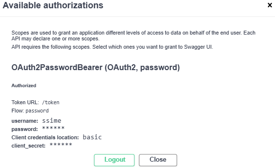
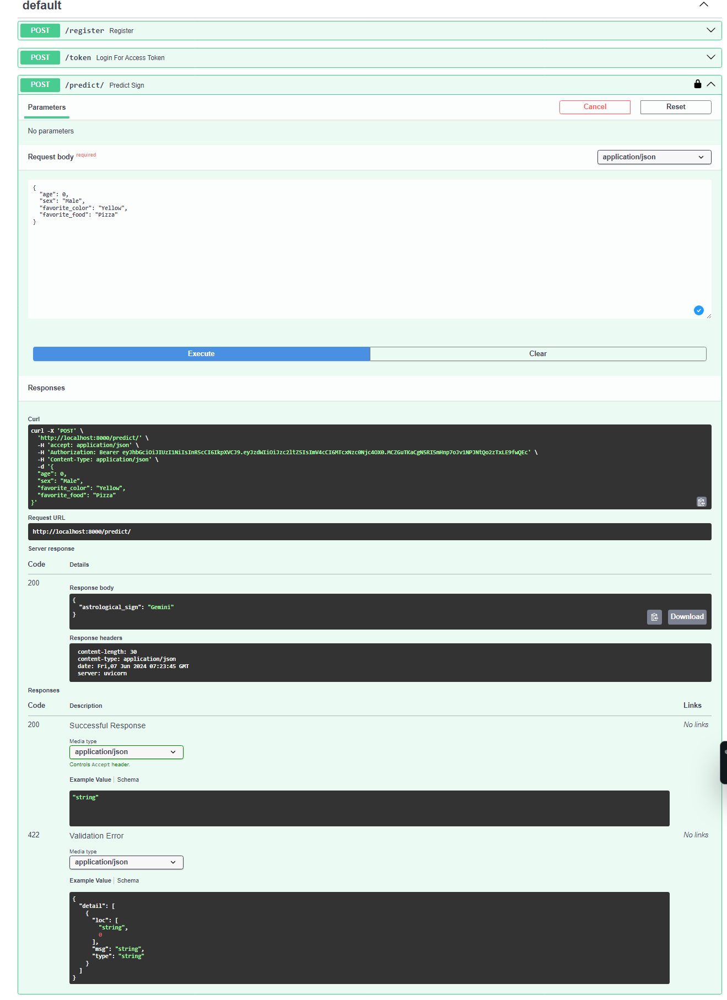
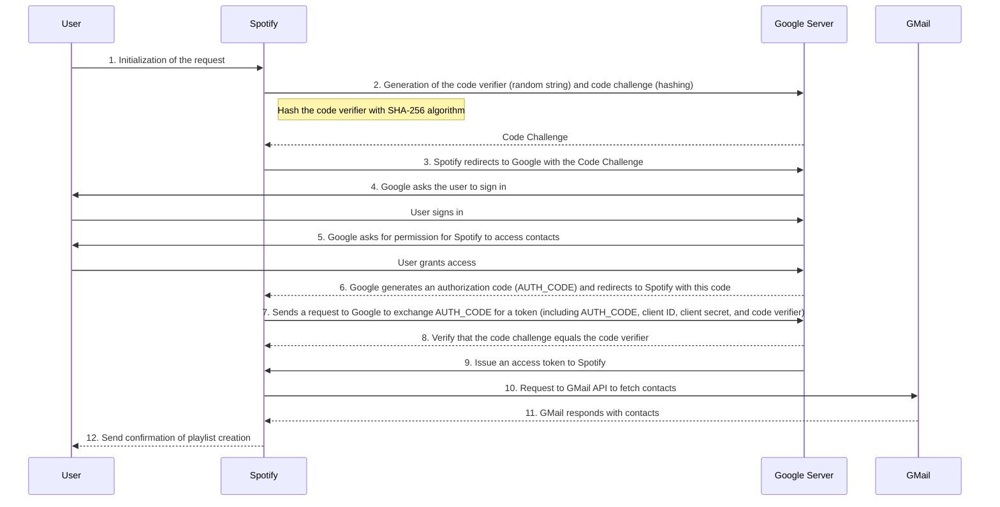

# Securing API

## 1. Setup

Run the following commands to set up the environment:

```sh
cd securing_api
python -m venv .sec_env
source  .sec_venv/bin/activate
pip install -r requirements.txt
```
> ** Special attention** : Never install `jwt`and `PyJWT`package at the same time. See [this thread](https://stackoverflow.com/questions/33198428/jwt-module-object-has-no-attribute-encode) on stackoverflow.
>
> Checkout the content of the `requirements.txt` file.

Now, we will try to secure a very basic API.

## 2. API V0 : Security attempt 1

Run the script:

```sh
# Running the script
python 1_clear_embedded_encryption.py
```

### Testing the API :
To test the API, you can use various tools such as `curl`, Postman, or Python scripts. Below, I'll provide examples for each method to test the `/predict/`, `/pseudonymize/`, and `/decrypt/{user_id}` endpoints.

#### Using `curl`

1. **Test `/predict/` endpoint:**

```sh
curl -X POST "http://localhost:8000/predict/" -H "Content-Type: application/json" -d '{
    "first_name": "John",
    "last_name": "Doe",
    "email": "john.doe@example.com",
    "age": 30,
    "sex": "Male",
    "favorite_color": "Red",
    "favorite_food": "Pizza"
}'
```

2. **Test `/pseudonymize/` endpoint:**

```sh
curl -X GET "http://localhost:8000/pseudonymize/"
```

3. **Test `/decrypt/{user_id}` endpoint (replace `{user_id}` with an actual user ID, e.g., `0`):**

```sh
curl -X GET "http://localhost:8000/decrypt/0"
```

#### Using Postman

1. **Test `/predict/` endpoint:**
    - Open Postman.
    - Create a new POST request with URL: `http://localhost:8000/predict/`.
    - Set the request body to `raw` and `JSON` format.
    - Use the following JSON body:

    ```json
    {
        "first_name": "John",
        "last_name": "Doe",
        "email": "john.doe@example.com",
        "age": 30,
        "sex": "Male",
        "favorite_color": "Red",
        "favorite_food": "Pizza"
    }
    ```

    - Click `Send`.

2. **Test `/pseudonymize/` endpoint:**
    - Create a new GET request with URL: `http://localhost:8000/pseudonymize/`.
    - Click `Send`.

3. **Test `/decrypt/{user_id}` endpoint:**
    - Create a new GET request with URL: `http://localhost:8000/decrypt/0` (assuming `0` is the user ID).
    - Click `Send`.

#### Using Python Script

1. **Test `/predict/` endpoint:**

```python
import requests

url = "http://localhost:8000/predict/"
data = {
    "first_name": "John",
    "last_name": "Doe",
    "email": "john.doe@example.com",
    "age": 30,
    "sex": "Male",
    "favorite_color": "Red",
    "favorite_food": "Pizza"
}
response = requests.post(url, json=data)
print(response.json())
```

2. **Test `/pseudonymize/` endpoint:**

```python
import requests

url = "http://localhost:8000/pseudonymize/"
response = requests.get(url)
print(response.json())
```

3. **Test `/decrypt/{user_id}` endpoint:**

```python
import requests

url = "http://localhost:8000/decrypt/0"
response = requests.get(url)
print(response.json())
```

### Best Practices Assessment: GDPR and Security

The used code demonstrates some good practices and areas for improvement in terms of GDPR and security. Let's break it down:

**Good Practices:**

* **Data Minimization:** The code only collects essential user data (first name, last name, email, age, sex, favorite color, and favorite food) for the prediction task. This minimizes the amount of personal data collected, adhering to the GDPR principle of data minimization.
* **Pseudonymization:** The `/pseudonymize/` endpoint pseudonymizes user data by hashing the encrypted data, making it difficult to link back to the individual user. This is a good step towards achieving data anonymization and minimizing privacy risks.
* **Input Validation:** The `validate_user_input` function checks user-provided data against predefined allowed classes, preventing invalid inputs and potential vulnerabilities.
* **Data Encryption:** The code encrypts user data with Fernet, providing protection against unauthorized access and data breaches.
* **Consent Implementation:**  The `/` endpoint now includes a simple JavaScript snippet that pops up an alert to the user, asking for consent before using their data. While this approach is basic, it's a good starting point for implementing consent mechanisms.

**Areas for Improvement:**

**GDPR Compliance:**

* **Transparency and Consent:**
    * The application lacks a clear privacy policy informing users about data collection, processing, and storage.
    * The code doesn't explicitly obtain consent from users before collecting and processing their personal data. 
* **Purpose Limitation:**
    * The application should specify the specific purpose for collecting user data and only process it for that stated purpose.
* **Data Retention:**
    * The code doesn't specify a retention policy for user data.  Data should be deleted when no longer needed for the specified purpose.
* **Data Subject Rights:**
    * The application should provide mechanisms for users to exercise their rights under GDPR (e.g., access, rectification, erasure, restriction). 

**Security:**

* **Encryption Key Management:**
    * The `generate_encryption_suite` function generates a new Fernet key on every server restart. This makes it very difficult to decrypt previously encrypted data if the server restarts or crashes. Consider storing the encryption key securely in a separate location, potentially using a Key Management System (KMS).
* **Secure Storage:**
    *  The `users` list stores encrypted data in memory. It's crucial to consider a secure storage mechanism for persistence, especially if the application scales. Options include databases, file storage with appropriate permissions, or encrypted storage services.
* **Input Sanitization:** While the code validates input, it doesn't sanitize the data to prevent potential vulnerabilities such as cross-site scripting (XSS) or SQL injection, which could be exploited if the user input is not properly cleaned before processing.
* **Authentication and Authorization:** The application doesn't implement any authentication or authorization mechanisms, exposing the entire API to unauthorized access.  Consider adding authentication and authorization methods to control who can access and modify the data. 

**Recommendations:**

* Implement a clear and concise privacy policy that aligns with GDPR principles.
* Obtain explicit consent from users before collecting and processing their personal data.
* Define a clear purpose limitation for data collection and processing.
* Establish a data retention policy and automatically delete data when it's no longer needed.
* Provide mechanisms for users to exercise their GDPR rights (access, rectification, erasure, etc.).
* Implement a secure encryption key management strategy, considering a Key Management System.
* Choose a secure storage mechanism for user data, considering persistence, scalability, and security.
* Sanitize user input before processing to prevent potential vulnerabilities.
* Add authentication and authorization mechanisms to control access to the API. 

By addressing these issues, the code can significantly improve its compliance with GDPR and security best practices, ensuring user privacy and data protection. 

### About Key Management Systems (KMS)

Here are some examples of Key Management Systems (KMS) for managing encryption keys, categorized by pricing and open-source status:

**Paid KMS:**

* **Amazon Key Management Service (KMS):** Offered as part of AWS, it provides robust key management, integration with other AWS services, and features like key rotation, hardware security modules (HSMs), and audit logging.
* **Google Cloud Key Management Service (KMS):** Google's KMS solution integrated into Google Cloud Platform, offering similar features to AWS KMS, including HSM support and compliance with various standards.
* **Microsoft Azure Key Vault:** Azure's key management service, providing key storage, access control, and integration with other Azure services. It offers both software and hardware-based security options.
* **Hashicorp Vault:** A popular open-core KMS solution that provides key management, secret storage, and access control. It offers both free and paid plans with varying features.

**Free and Open-Source KMS:**

* **Vault (HashiCorp):**  While Vault is a paid offering in the enterprise edition, its core functionality for key management is open-source and free to use.  Vault is popular due to its flexible architecture, strong community, and support for multiple platforms.
* **Kubernetes Secrets Manager:** This is a KMS specifically designed for Kubernetes environments. It's built into Kubernetes and handles key storage and retrieval for applications running within the cluster.
* **Confidentiality Key Management System (CKMS):** This is a free and open-source KMS developed by the University of California, Berkeley. CKMS focuses on secure key management for distributed systems and features a decentralized architecture.

**Choosing the Right KMS:**

* **Integration:** Choose a KMS that integrates well with your existing infrastructure (e.g., cloud platform, development tools, and security systems).
* **Features:**  Consider the features you need, such as key rotation, HSM support, audit logging, compliance with standards (e.g., FIPS 140-2, GDPR), and integration with other security tools.
* **Scalability:**  Choose a KMS that can scale with your needs and handle large numbers of keys and operations.
* **Cost:**  Evaluate the pricing models of different KMS options and choose one that fits your budget.

**Key Considerations for Selecting a KMS:**

* **Security:** The KMS should provide robust security features to protect keys from unauthorized access, disclosure, and tampering.
* **Ease of Use:** The KMS should be easy to use, configure, and integrate into your existing systems.
* **Compliance:**  Ensure the KMS meets relevant regulatory requirements for data protection and security (e.g., GDPR, HIPAA, PCI DSS).
* **Support:**  Choose a KMS with adequate support options to help you resolve issues and maintain compliance.

Remember that security is a continuous process. Choose a KMS solution that fits your specific needs, monitor its performance, and regularly update it to ensure the ongoing security of your encryption keys.

## 2.2 API V2 : Securing attempt 2

**Same code**, but with an absent key and using a `.env` file to store the encryption key. Suitable for prototype phase, but better with the key stored in a KMS or in the directly define in the production environment.

### GDPR considerations
This version makes a significant improvement by moving the encryption key to an environment variable, addressing one of the key security concerns from the previous version. Let's break down the changes and assess the best practices:

**Improvements:**

* **Encryption Key Management:** The `generate_encryption_suite` function now retrieves the encryption key from the environment variable `ENCRYPTION_KEY` using `os.getenv("ENCRYPTION_KEY")`. This is a better approach as it avoids hardcoding the key within the code, making it harder for attackers to discover it.

**Areas for Improvement:**

* **Encryption Key Management:** While storing the key in an environment variable is a good step, it's still not the most secure practice. For production environments, consider using a dedicated Key Management System (KMS) to manage encryption keys, as they offer features like key rotation, access control, and auditing.
* **Consent Mechanism:** The current JavaScript-based alert is very basic and lacks clear information about data collection, processing, and the user's rights.  Consider implementing a more robust consent mechanism that:
    * Clearly states the data collected, its purpose, and how it's used.
    * Explains the user's rights under GDPR (access, rectification, erasure, etc.).
    * Uses a more visible and interactive interface for consent (e.g., a check-box or a modal popup).
* **Data Storage:** The `users` list still stores encrypted data in memory, making it susceptible to data loss if the server restarts or crashes.  Consider implementing a secure storage mechanism like a database or encrypted file storage to persist the data and ensure its availability.
* **Input Sanitization:**  While the code validates user input, it lacks sanitization, which is still crucial for protecting against vulnerabilities like XSS and SQL injection.

**Recommendations:**

* **Implement a Secure Key Management System (KMS) for production environments.** This will greatly enhance the security of encryption key management.
* **Develop a more robust consent mechanism.**  Provide clear and detailed information about data usage and user rights.
* **Choose a secure and persistent storage solution for user data.**  Use a database or encrypted file storage to ensure data availability and resilience.
* **Sanitize user input to prevent potential vulnerabilities.**  Implement input sanitization techniques to protect against XSS and SQL injection attacks.
* **Consider adding authentication and authorization mechanisms.**  Control access to the API to prevent unauthorized users from accessing or modifying user data.


## 2.3 API V3: Simple OAuth : with password bearer (script `3_example_jwt.py`)

OAuth = Set of protocols (auth-code used with several apps interacting at the same time).

To use it, follow the steps below

1. launch the API: `python 3_example_oauth`.
2. register a user on the `register/` endpoint or use `ssime:test` (username:password already defined)
3. authenticate with the creds above : 

5. Test the `./precedict` route
4. The `token` route is simply the way to authenticate programmatically


## 2.4 Authentication & Authorization with more than two applications with OAuth 2.0

This detailed breakdown explains the steps involved in the OAuth 2.0 flow for sharing a Spotify playlist with Gmail contacts use case. It highlights the key actors, actions, and details at each stage of the process.




Here are the associated explanations for each stage of the OAuth 2.0 flow:

| **Step**                       | **Actor**             | **Action**                                                                                             | **Details**                                                                                                                                                                       |
|--------------------------------|-----------------------|--------------------------------------------------------------------------------------------------------|-----------------------------------------------------------------------------------------------------------------------------------------------------------------------------------|
| **1. Request Initiation** | User            | Opens Spotify and selects the option to share a playlist with Gmail contacts.               |                                                                                                                                                                                   |
| **2. Generation of Code Verifier and Code Challenge** | Spotify               | Generates a "Code Verifier" (random string) and a "Code Challenge" (hash of the Code Verifier).         | Code Verifier: random string. <br> Code Challenge: hash of the Code Verifier using SHA-256.                                                                                     |
| **3. Redirect to Authorization Server** | Spotify               | Redirects to Google with the Code Challenge.                                                           | URL: `https://accounts.google.com/o/oauth2/auth?response_type=code&client_id=SPOTIFY_CLIENT_ID&redirect_uri=SPOTIFY_REDIRECT_URI&scope=email+profile+contacts&code_challenge=CODE_CHALLENGE&code_challenge_method=S256` |
| **4. User Authentication** | User & Google | Google asks the user to log in.                                                         | Enter login credentials (email and password).                                                                                                                                  |
| **5. Consent Request**  | Google & User   | Google requests permission for Spotify to access Gmail contacts.                                | Display of requested permissions.                                                                                                                                              |
| **6. User Authorization** | User            | Authorizes or denies access to Gmail contacts.                                                       | If authorized, Google generates an authorization code.                                                                                                                                |
| **7. Redirect to Spotify with Authorization Code** | Google                | Redirects to Spotify with the authorization code.                                                      | URL: `https://spotify.com/callback?code=AUTH_CODE`                                                                                                                               |
| **8. Exchange Authorization Code for Access Token with Code Verifier** | Spotify               | Sends a request to Google to exchange the authorization code for an access token.               | Includes the authorization code, client ID, client secret, and Code Verifier. <br> **The information is directly exchanged between servers, not via the browser.**                                                        |
| **9. Code Challenge Verification** | Google                | Verifies that the Code Challenge matches the Code Verifier.                                              | Hashes the Code Verifier and compares it to the initial Code Challenge.                                                                                                           |
| **10. Obtaining the Access Token** | Google                | Issues an access token to Spotify.                                                                    | Access token allowing access to Gmail contacts.                                                                                                                            |
| **11. Use of Access Token to Access Resources** | Spotify               | Sends a request to the Gmail API to retrieve the user's contacts.                          | GET request to the Gmail endpoint: `https://www.googleapis.com/gmail/v1/users/me/contacts`                                                                                       |
| **12. Access to Contacts and Playlist Sharing** | Gmail & Spotify       | Gmail responds with the contact information.                                                       | Spotify uses this information to send the playlist to Gmail contacts.                                                                                                     |
| **13. Confirmation and Revocation** | User            | Receives confirmation that the playlist has been sent.                                                   | Can revoke Spotify's access to contacts via Google settings.                                                                                                       |

# MLOPS Best Practices for Security and GDPR:

| MLOPS Stage | Security Best Practices | GDPR Considerations | Requirements |
|---|---|---|---|
| **Data Collection & Preparation** |  * **Data Minimization:** Only collect necessary data for the model's purpose.  <br> * **Data Anonymization:** Consider techniques like pseudonymization or differential privacy to anonymize sensitive data. <br> * **Secure Data Storage:** Use encrypted storage solutions (e.g., databases, file systems) with access control. | * **Purpose Limitation:** Clearly define the purpose for data collection and processing. <br> * **Transparency:** Provide clear information about data usage and user rights. <br> * **Data Retention:** Establish a retention policy and delete data when no longer needed. |  * **Consent:** Obtain explicit consent from users before collecting personal data. <br> * **Privacy Policy:** Publish a comprehensive privacy policy that outlines data practices. |
| **Model Development & Training** | * **Secure Development Environment:** Use secure coding practices, code reviews, and automated vulnerability scans. <br> * **Model Privacy:** Incorporate privacy-enhancing techniques (e.g., differential privacy) into the model training process to minimize risks of re-identification. <br> * **Data Integrity:** Use data validation and anomaly detection mechanisms to ensure data quality. | * **Purpose Limitation:** Ensure that model training and predictions are aligned with the stated purpose of data collection. <br> * **Accountability:** Document all data processing steps and model decisions for auditability. |  * **Data Subject Rights:** Implement mechanisms for users to exercise their rights (e.g., access, rectification, erasure). |
| **Model Evaluation & Deployment** | * **Model Security Testing:** Conduct security testing and penetration testing to identify vulnerabilities. <br> * **Monitoring & Logging:** Implement monitoring systems to detect anomalies, unauthorized access, and potential data breaches. <br> * **Secure Deployment:** Use secure containerization and deployment tools. | * **Data Protection by Design:** Ensure that security and privacy considerations are integrated into all stages of model deployment. <br> * **Data Retention:** Establish a policy for model outputs and predictions. |  * **Data Subject Rights:**  Enable users to access and delete their data associated with predictions. |
| **Model Serving & API** | * **Authentication & Authorization:** Implement authentication and authorization mechanisms to control access to the API.  <br> * **Input Validation & Sanitization:**  Validate and sanitize user inputs to prevent vulnerabilities like XSS and SQL injection. <br> * **Rate Limiting:**  Implement rate limiting to prevent denial-of-service attacks. <br> * **Encryption in Transit:** Secure data transmission with HTTPS and SSL/TLS encryption. | * **Transparency:** Provide clear documentation about data processing and privacy practices within the API. <br> * **Purpose Limitation:** Ensure the API only processes data for its intended purpose.  <br> * **Data Subject Rights:** Implement mechanisms to handle user requests related to their data (access, rectification, erasure).  | * **Consent:**  Ensure API users understand and consent to data processing for predictions. <br> * **Privacy Policy:**  Clearly communicate data practices within the API documentation and terms of service. |
| **Model Monitoring & Maintenance** | * **Continuous Security Monitoring:** Monitor model performance and detect any security vulnerabilities or anomalies. <br> * **Security Patching & Updates:** Regularly update and patch models and infrastructure to address security vulnerabilities. <br> * **Model Retraining & Updates:** Re-train models with updated data and security enhancements. | * **Data Quality Monitoring:**  Monitor data quality and identify potential data breaches or privacy violations. <br> * **Model Bias Detection:**  Monitor model performance for biases that could lead to unfair or discriminatory outcomes.  | * **Data Retention & Deletion:**  Adhere to established retention policies and ensure timely data deletion. <br> * **Auditing & Documentation:**  Maintain records of data processing and model decisions for auditability and compliance purposes. |


**Key Requirements for All Stages:**

* **Secure Infrastructure:**  Use secure and reliable infrastructure (cloud providers, on-premises) with appropriate security controls and monitoring.
* **Secure Communication:**  Encrypt data in transit and at rest to protect against unauthorized access.
* **Strong Access Control:**  Implement granular access control to restrict user access to sensitive data and model components.
* **Regular Security Audits:**  Conduct regular security audits to identify vulnerabilities and ensure compliance.
* **Data Governance Framework:**  Establish a data governance framework with clear policies and processes for managing data privacy and security.

## 2.5 Oauth2 protocol