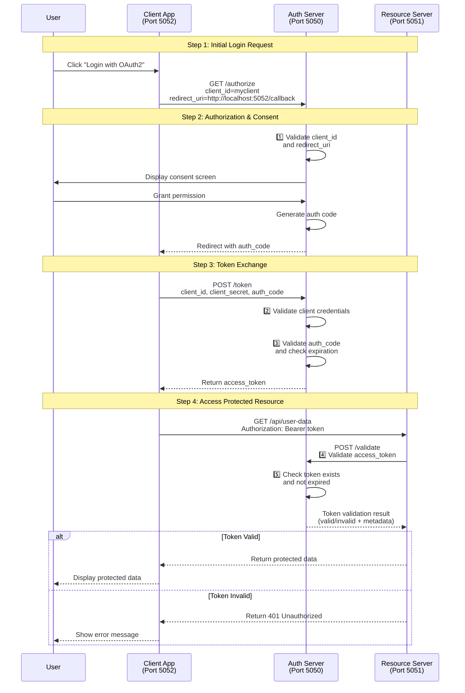

# OAuth2 Flow Demonstration

A comprehensive educational demonstration of the OAuth2 authorization flow, implemented with Python and Flask. This project shows how different components in an OAuth2 system interact to provide secure authorization and resource access.

## Table of Contents
- [Overview](#overview)
- [System Architecture](#system-architecture)
- [OAuth2 Flow Explanation](#oauth2-flow-explanation)
- [Installation](#installation)
- [Running the Demo](#running-the-demo)
- [Component Details](#component-details)
- [Understanding the Code](#understanding-the-code)
- [Security Considerations](#security-considerations)
- [Troubleshooting](#troubleshooting)

## Overview

This demo implements a complete OAuth2 authorization flow with three separate servers:
- Authorization Server (Port 5050): Handles authentication and issues tokens
- Resource Server (Port 5051): Provides protected resources
- Client Application (Port 5052): Demonstrates how to obtain and use OAuth2 tokens

Each step of the OAuth2 flow is clearly logged and visualized in the browser, making it ideal for learning how OAuth2 works.

## System Architecture



## OAuth2 Flow Explanation

1. **Initial Request (Authorization Code Request)**
   - User clicks "Login" on the client application
   - Client redirects to Authorization Server with:
     - client_id
     - redirect_uri
     - response_type=code

2. **Authorization Grant & User Consent**
   - Authorization Server validates the request
   - User is presented with a consent screen
   - User explicitly grants permission
   - Server generates a temporary authorization code
   - Redirects back to Client's callback URL with the code

3. **Access Token Request**
   - Client receives the authorization code
   - Sends to Authorization Server with:
     - client_id
     - client_secret
     - authorization_code
   - Server validates and returns access token

4. **Resource Access with Token Validation**
   - Client uses access token to request protected resources
   - Resource Server validates token by calling Auth Server's /validate endpoint
   - Auth Server verifies token validity and expiration
   - Resource Server returns requested data if token is valid

## Installation

1. **Prerequisites**
   - Python 3.7 or higher
   - pip (Python package manager)
   - Terminal/Command Prompt

2. **Setup Virtual Environment**
   ```bash
   # Create virtual environment
   python3 -m venv .venv

   # Activate virtual environment
   # On macOS/Linux:
   source .venv/bin/activate
   # On Windows:
   .venv\Scripts\activate
   ```

3. **Install Dependencies**
   ```bash
   pip install -r requirements.txt
   ```

## Running the Demo

1. **Start Authorization Server**
   ```bash
   # Terminal 1
   python auth_server/auth_server.py
   ```

2. **Start Resource Server**
   ```bash
   # Terminal 2
   python resource_server/resource_server.py
   ```

3. **Start Client Application**
   ```bash
   # Terminal 3
   python client_app/client_app.py
   ```

4. **Access the Application**
   - Open browser to http://localhost:5052
   - Click "Login with OAuth2"
   - Watch the process in both browser and terminal logs

## Component Details

### Authorization Server (Port 5050)
- Handles client registration and validation
- Manages user consent and authorization
- Issues and validates access tokens
- Provides `/authorize`, `/token`, and `/validate` endpoints
- Maintains token state and expiration

### Resource Server (Port 5051)
- Protects sensitive resources
- Validates access tokens with Auth Server
- Implements proper token validation through Auth Server's `/validate` endpoint
- Returns protected data only after successful token validation

### Client Application (Port 5052)
- Demonstrates OAuth2 flow
- Implements client-side logic for authorization and token management
- Visualizes the OAuth2 flow for educational purposes

## Understanding the Code

### Key Files
```
oauth2/
├── auth_server/
│   └── auth_server.py      # Authorization server implementation
├── resource_server/
│   └── resource_server.py  # Protected resource server
├── client_app/
│   ├── client_app.py       # OAuth2 client implementation
│   └── templates/          # HTML templates for visualization
└── requirements.txt        # Project dependencies
```

### Important Code Sections

1. **Authorization Code Generation**
   ```python
   # In auth_server.py
   auth_code = ''.join(random.choices(string.ascii_letters + string.digits, k=8))
   auth_codes[auth_code] = {
       'client_id': client_id,
       'expires': time.time() + 600  # 10 minutes expiration
   }
   ```

2. **Token Exchange**
   ```python
   # In auth_server.py
   access_token = ''.join(random.choices(string.ascii_letters + string.digits, k=16))
   tokens[access_token] = {
       'client_id': client_id,
       'expires': time.time() + 3600  # 1 hour expiration
   }
   ```

3. **Protected Resource Access with Token Validation**
   ```python
   # In resource_server.py
   def validate_token(access_token):
       """
       Validate the access token with the Authorization Server
       Returns (is_valid, error_message)
       """
       try:
           response = requests.post(
               f"{AUTH_SERVER_URL}/validate",
               json={"access_token": access_token},
               timeout=5
           )
           
           if response.status_code == 200:
               return True, None
           else:
               error_data = response.json()
               return False, error_data.get("error", "Token validation failed")
               
       except requests.exceptions.RequestException as e:
           logger.error(f"Error communicating with auth server: {str(e)}")
           return False, "Error validating token with authorization server"

   @app.route('/api/user-data')
   def get_user_data():
       """Protected endpoint that requires a valid access token"""
       logger.info("Received request for protected user data")
       
       # Get the authorization header
       auth_header = request.headers.get('Authorization')
       if not auth_header or not auth_header.startswith('Bearer '):
           logger.error("No valid authorization header found")
           return jsonify({"error": "Missing or invalid authorization header"}), 401

       # Extract the token
       access_token = auth_header.split(' ')[1]
       logger.info(f"Received access token: {access_token}")
       
       # Validate the token with the Authorization Server
       is_valid, error = validate_token(access_token)
       
       if not is_valid:
           logger.error(f"Token validation failed: {error}")
           return jsonify({"error": error}), 401
       
       # If we get here, the token is valid
       logger.info("Token is valid, returning protected data")
       return jsonify({
           "message": "Access granted!",
           "data": PROTECTED_DATA
       })
   ```

## Security Considerations

This is a demonstration project with several simplifications:

1. **Storage**
   - Uses in-memory storage instead of a database
   - No persistent user or token storage

2. **Token Security**
   - Simple token generation
   - Basic validation mechanisms
   - No token encryption

3. **Authentication**
   - No real user authentication
   - Simplified client credentials

4. **Production Requirements**
   - Add SSL/TLS
   - Implement proper data storage
   - Add rate limiting
   - Enhance token security
   - Add proper error handling

## Troubleshooting

### Common Issues

1. **Port Conflicts**
   ```bash
   # Check for used ports
   lsof -i :5050,5051,5052   # On macOS/Linux
   netstat -ano | findstr "5050 5051 5052"  # On Windows
   ```

2. **Server Not Starting**
   - Ensure virtual environment is activated
   - Verify all dependencies are installed
   - Check port availability

3. **Authorization Fails**
   - Verify all three servers are running
   - Check client_id and client_secret
   - Ensure redirect_uri matches exactly

### Logging

All components include detailed logging:
```python
logging.basicConfig(
    level=logging.INFO,
    format='%(asctime)s - %(levelname)s - [SERVER] %(message)s'
)
```

Monitor the terminal output to understand the flow and diagnose issues.

## Contributing

Feel free to submit issues and enhancement requests!