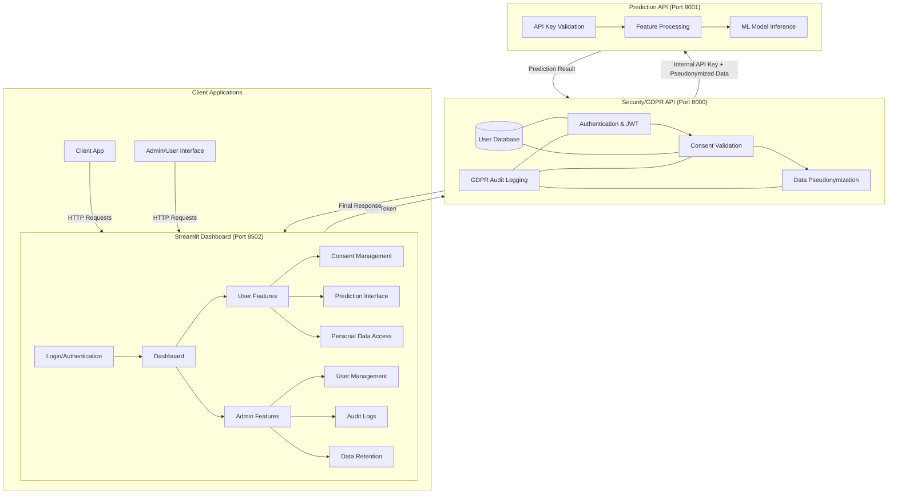

# GDPR-Compliant API System

## Architecture Overview

This project implements a GDPR-compliant machine learning API system using a two-API architecture that separates security concerns from prediction functionality. This separation is crucial for maintaining GDPR compliance while allowing the ML system to operate efficiently.

### Key Components

1. **Security API**: Handles user authentication, consent management, and data pseudonymization
2. **Prediction API**: Performs machine learning predictions without access to personally identifiable information
3. **Streamlit Dashboard**: User-friendly interface for clients and administrators to interact with the system
4. **Unified Database**: Stores user data, consent records, and audit logs in a GDPR-compliant manner
5. **Automated Data Retention**: Scheduled cleanup of expired data to comply with data minimization principles

### Architecture Diagram



### Why This Architecture?

1. **Separation of Concerns**
   - Security API handles all PII (Personally Identifiable Information) and GDPR compliance
   - Prediction API works only with pseudonymized data, reducing compliance scope

2. **Data Protection by Design**
   - PII never reaches the prediction system
   - Consent tracking happens before data processing
   - Audit logging captures all GDPR-relevant actions

3. **Scalability**
   - Each API can scale independently based on different workloads
   - ML models can be updated without affecting security components

## Implementation Details

### Core Components

1. **Security/GDPR API** (Port 8000)
   - **Authentication**: JWT-based token system with bcrypt password hashing
   - **User Management**: SQLite database with secure storage
   - **Consent Tracking**: Explicit consent required for data processing
   - **Data Pseudonymization**: Transforms PII into non-identifiable format
   - **GDPR Rights**: Endpoints for data access, deletion, and consent management

2. **Prediction API** (Port 8001)
   - **Internal Authentication**: API key validation
   - **ML Model**: Scikit-learn based prediction system
   - **Data Processing**: Works only with pseudonymized features
   - **No PII Access**: Cannot reverse pseudonymization

### API Communication Flow

1. Client authenticates with Security API and receives JWT token
2. Client sends data with token to Security API
3. Security API:
   - Validates token and consent
   - Pseudonymizes sensitive data
   - Forwards request to Prediction API with internal API key
4. Prediction API:
   - Validates internal API key
   - Makes prediction on pseudonymized data
   - Returns results to Security API
5. Security API returns results to client

## Setup & Installation

```bash
# Clone repository and navigate to project directory
cd securing_api

# Start services
docker compose up --build

# Or use the Makefile
make up
```

## Streamlit Dashboard

The system includes a Streamlit-based dashboard that provides a user-friendly interface for both end clients and administrators to interact with the APIs.

### Features

#### Client Features
- **User Authentication**: Login and registration
- **Consent Management**: View, grant, and revoke consents with customizable expiration periods
- **Make Predictions**: Submit data for zodiac sign prediction with pseudonymization
- **Personal Data Access**: View and export personal data stored in the system

#### Admin Features
- **User Management**: View and manage user accounts
- **Audit Logs**: Monitor system activities for compliance verification
- **Database Management**: Execute database commands through a user-friendly interface
- **Data Retention**: Monitor and manage data retention policies and expired consents

### Authentication Flow in Streamlit

The Streamlit app implements a secure authentication flow that integrates with the Security API:

1. **Login Process**:
   ```mermaid
   sequenceDiagram
       participant User
       participant Streamlit as Streamlit App
       participant Security as Security API
       participant DB as Database
       
       User->>Streamlit: Enter credentials
       Streamlit->>Security: POST /token with credentials
       Security->>DB: Verify credentials
       DB->>Security: Credentials valid
       Security->>Streamlit: Return JWT token
       Streamlit->>Streamlit: Store token in session state
       Streamlit->>User: Redirect to dashboard
   ```

2. **Session Management**:
   - JWT token is stored in Streamlit's session state
   - Token is included in all subsequent API requests
   - Session expiration handled automatically
   - Logout clears the session state

3. **Security Considerations**:
   - Passwords never stored in Streamlit
   - All sensitive operations performed by Security API
   - Token-based authentication prevents session hijacking
   - HTTPS recommended for production deployments

### Running the Streamlit App

```bash
# Install dependencies
make streamlit-install

# Run locally
make streamlit-run

# Or with Docker
make up  # Starts all services including Streamlit

# Open in browser
make streamlit-open  # Opens http://localhost:8502
```

## Future Improvements

The current implementation provides a solid foundation for a GDPR-compliant ML system, but several enhancements could further improve security, scalability, and functionality:

### Security Enhancements

1. **Robust User Role Management**:
   - Implement fine-grained role-based access control (RBAC)
   - Support for custom roles with specific permissions
   - Role hierarchy with inheritance of permissions

2. **Advanced Authentication**:
   - Multi-factor authentication (MFA) support
   - OAuth2 integration for third-party authentication
   - Certificate-based authentication for service-to-service communication

3. **Enhanced Encryption**:
   - Field-level encryption for sensitive data
   - Client-side encryption for certain operations
   - Homomorphic encryption for privacy-preserving computation

### Infrastructure Improvements

1. **Production-Grade Deployment**:
   - Reverse proxy setup with Nginx or Traefik
   - Load balancing for horizontal scaling
   - TLS termination and certificate management

2. **High Availability**:
   - Redundant API instances
   - Database replication and failover
   - Distributed caching layer

3. **Monitoring and Observability**:
   - Centralized logging with ELK stack
   - Prometheus metrics and Grafana dashboards
   - Distributed tracing with Jaeger or Zipkin

### ML Pipeline Enhancements

1. **Model Registry**:
   - Version control for ML models
   - A/B testing framework
   - Automated model evaluation

2. **Advanced ML Features**:
   - Online learning capabilities
   - Explainable AI components
   - Drift detection and model retraining

3. **Data Pipeline**:
   - Streaming data processing
   - Feature store implementation
   - Data validation and quality checks

### GDPR Compliance Extensions

1. **Enhanced Data Subject Rights**:
   - Automated data portability
   - Right to object implementation
   - Restriction of processing controls

2. **Compliance Documentation**:
   - Automated DPIA (Data Protection Impact Assessment)
   - Record of processing activities
   - Consent receipt generation

3. **Cross-Border Data Transfers**:
   - SCCs (Standard Contractual Clauses) management
   - Regional data residency controls
   - Privacy Shield alternative mechanisms

## API Endpoints

### Security API
- `POST /register` - Register new user
- `POST /token` - Get JWT authentication token
- `POST /pseudonymize` - Pseudonymize sensitive data
- `POST /consent` - Manage user consent preferences
- `GET /user/data` - Access user data (GDPR right of access)
- `DELETE /user/data` - Delete user data (GDPR right to erasure)
- `POST /forward-to-prediction` - Forward pseudonymized data to Prediction API

### Prediction API
- `POST /predict` - Make predictions (internal use only)

## Testing

Use the provided test script to verify functionality:

```bash
./test_api.sh
```

Or test individual endpoints:

```bash
# Register user
curl -X POST "http://localhost:8000/register" \
  -H "Content-Type: application/json" \
  -d '{"username":"testuser","password":"Testpass123!"}'

# Get token
curl -X POST "http://localhost:8000/token" \
  -H "Content-Type: application/x-www-form-urlencoded" \
  -d "username=testuser&password=Testpass123!"

# Store token for subsequent requests
TOKEN="your-token-here"

# Make prediction with pseudonymized data
curl -X POST "http://localhost:8000/forward-to-prediction" \
  -H "Authorization: Bearer $TOKEN" \
  -H "Content-Type: application/json" \
  -d '{"feature1":1,"feature2":2,"feature3":3}'
```

## GDPR Compliance Features

- **Data Pseudonymization**: PII is transformed before processing, ensuring that sensitive personal data is never directly exposed to the prediction system
- **Consent Management**: Explicit opt-in required for data processing with configurable expiration dates
- **Audit Logging**: All GDPR-relevant actions are comprehensively logged with timestamps and user references
- **Data Retention**: Automated 30-day cleanup of expired data through a scheduled background job
- **Right to Access**: Endpoints for users to access their data and view their current consent status
- **Right to Erasure**: Endpoints for users to delete their data with confirmation requirements

## Data Organization and Retention

### Data Storage

The system organizes data into three main categories:

1. **User Data**: Basic account information stored in the users table
2. **Consent Records**: User consent information with expiration dates
3. **Audit Logs**: Records of all GDPR-relevant actions for compliance tracking

### Data Retention Implementation

Data retention is implemented through a multi-layered approach:

1. **Scheduled Cleanup**: A background scheduler runs daily to automatically remove expired data
2. **Configurable Retention Period**: Default retention period is 30 days, but can be configured
3. **Consent Expiration**: Each consent has an expiration date after which it becomes invalid
4. **Audit Trail**: All cleanup operations are logged for compliance verification

### Data Persistence

The system uses a unified SQLite database stored in the `data/` directory, which is mounted as a volume for persistence across container restarts. This approach ensures data consistency, enables proper foreign key relationships, and simplifies backup and maintenance.

### Database Structure

1. **Unified Database** (`gdpr_db.sqlite`)
   
   - **Table: users**
     - `id`: Integer, Primary Key, Autoincrement
     - `username`: Text, Unique
     - `hashed_password`: Text (bcrypt hashed)
     - `disabled`: Boolean
     - `created_at`: Timestamp
   
   - **Table: consents**
     - `id`: Integer, Primary Key, Autoincrement
     - `username`: Text (Foreign key to users.username)
     - `consent_type`: Text (e.g., "data_processing", "data_storage")
     - `granted`: Boolean
     - `granted_at`: Timestamp
     - `expires_at`: Timestamp
     - Foreign Key: username references users(username) ON DELETE CASCADE
     - Unique Constraint: (username, consent_type)
   
   - **Table: audit_log**
     - `id`: Integer, Primary Key, Autoincrement
     - `timestamp`: Timestamp
     - `action_type`: Text
     - `username`: Text (Foreign key to users.username)
     - `details`: Text
     - Foreign Key: username references users(username) ON DELETE SET NULL

2. **External Audit Log** (`/app/logs/gdpr_audit.log`)
   - Redundant log file for compliance and debugging
   - Format: `[timestamp] action_type - User: username - Details: additional_info`
   - Actions logged: user_registered, user_login, data_access, pseudonymization, etc.

### Data Lifecycle

1. **User Registration**
   - User credentials stored in users.db
   - Default consents created in consents.db
   - Registration logged in audit log

2. **Authentication**
   - Credentials verified against users.db
   - Consents checked in consents.db
   - Login logged in audit log

3. **Data Processing**
   - PII pseudonymized before processing
   - Only pseudonymized data sent to Prediction API
   - Processing logged in audit log

4. **Data Retention**
   - Background scheduler runs daily cleanup of expired data
   - Consents with passed expiration dates are automatically removed
   - Cleanup operations use SQLite's datetime functions for reliable date comparison
   - Number of removed records is tracked and logged
   - All cleanup actions are recorded in the audit log with detailed information
   - Database audit commands available for monitoring and troubleshooting

## Implementation Details

### Data Retention Scheduler

The system implements automated data retention through a background scheduler that runs daily to clean up expired data. This ensures compliance with GDPR's data minimization principle by automatically removing data when its retention period expires.

#### Scheduler Configuration

```python
# Set up scheduled cleanup job for data retention
scheduler = BackgroundScheduler()
scheduler.add_job(
    consent_manager.cleanup_expired_consents,
    'interval',
    hours=24,  # Run daily
    id='cleanup_expired_data'
)

# Start the scheduler when the application starts
@app.on_event("startup")
def start_scheduler():
    scheduler.start()
    print("Data retention scheduler started - will clean up expired data every 24 hours")

# Shutdown the scheduler when the application stops
@app.on_event("shutdown")
def shutdown_scheduler():
    scheduler.shutdown()
```

#### Cleanup Implementation

The cleanup process uses SQLite's datetime functions for reliable date comparison and tracks the number of records removed:

```python
def cleanup_expired_data():
    """Remove expired consents and perform other cleanup tasks"""
    conn = get_db_connection()
    try:
        # Delete expired consents using explicit SQLite datetime function
        cursor = conn.cursor()
        cursor.execute("DELETE FROM consents WHERE expires_at < datetime('now')")
        deleted_count = cursor.rowcount
        
        # Log the cleanup action with count of deleted records
        conn.execute(
            "INSERT INTO audit_log (action_type, details) VALUES (?, ?)",
            ("data_cleanup", f"Removed {deleted_count} expired consents")
        )
        
        conn.commit()
        return deleted_count
    finally:
        conn.close()
```

#### Database Audit Commands

The system provides several database audit commands through the Makefile to monitor and troubleshoot the data retention process:

```bash
# Check for expired consents
make db-check-expired

# Force cleanup of expired consents
make db-cleanup-expired

# List all consents in the database
make db-list-consents

# List all audit log entries
make db-list-audit
```

### Scheduler Lifecycle

The scheduler is initialized when the Security API starts and runs in the background. It calls the `cleanup_expired_consents` method daily, which removes any expired consents from the database. The scheduler is properly shut down when the application stops to prevent resource leaks.

### Consent Expiration

Consents are stored with an expiration date, calculated based on the `days_valid` parameter:

```python
def add_consent(username: str, consent_type: str, granted: bool = True, days_valid: int = 365):
    # Calculate expiration date
    expires_at = datetime.now() + timedelta(days=days_valid) if granted and days_valid > 0 else None
    # Store consent with expiration date
    # ...
```

When a consent expires, it is automatically removed by the data retention scheduler.

### Testing Data Retention

You can test the data retention mechanism using the following commands:

```bash
# Grant a consent with a short expiration period
make grant-consent TOKEN=your_token

# Check current consents
make get-consents TOKEN=your_token

# Force scheduler restart to trigger cleanup
make force-cleanup

# Check logs for cleanup actions
make check-retention
```

The test script also includes automated testing of the data retention mechanism by creating a short-lived consent and verifying it gets removed.

## Project Structure

```sh
securing_api/
├── src/
│   ├── security_api/        # GDPR compliance and security
│   │   ├── security_api.py  # Main API endpoints
│   │   ├── consent_manager.py # Consent tracking
│   │   ├── gdpr_utils.py    # Pseudonymization and logging
│   │   ├── user_db.py       # Unified database management
│   │   └── requirements.txt # Dependencies
│   └── prediction_api/      # ML prediction service
│       ├── prediction_api.py # Prediction endpoints
│       └── requirements.txt # Dependencies
├── docker/                  # Docker configuration
│   ├── Dockerfile.security  # Security API container
│   └── Dockerfile.prediction # Prediction API container
├── data/                    # Persistent database storage
│   └── gdpr_db.sqlite       # Unified SQLite database
├── logs/                    # GDPR audit logs
│   └── gdpr_audit.log       # Audit log file
├── models/                  # ML model storage
├── docker-compose.yml       # Service orchestration
├── Makefile                 # Common commands
└── test_api.sh              # Comprehensive testing script
```

## Implementation Improvements

The implementation has been improved in several ways:

1. **Unified Database**: The system now uses a single SQLite database with multiple tables, which provides better data consistency, enables proper foreign key relationships, and simplifies backup and maintenance.

2. **Robust Persistence**: The database is stored in a Docker volume, ensuring data persists across container restarts and updates.

3. **Automated Data Retention**: The system includes a background scheduler that automatically cleans up expired data daily, ensuring compliance with GDPR's data minimization principle.

4. **Comprehensive GDPR Compliance**: The system implements all required GDPR features, including pseudonymization, consent management, audit logging, data retention, and user rights.

5. **Enhanced Security**: The system uses JWT for secure authentication and bcrypt for password hashing.

6. **Improved Error Handling**: The system provides clear error messages and handles edge cases gracefully.

### 2. Robust Persistence

The database is properly persisted through Docker volumes:

{{ ... }}
- **Read-Write Permissions**: Explicit permission settings for security
- **Automatic Restart**: Containers restart automatically if they crash
- **Backup Mechanism**: Built-in commands for database backup/restore

### 3. Comprehensive Testing

The system includes a complete testing script that verifies:

- User registration and authentication
- Consent management
- Data pseudonymization
- Prediction functionality
- Error handling
- Database persistence
- GDPR compliance

## Development

Use the Makefile for common operations:

```bash
make up        # Start services
make down      # Stop services
make logs      # View logs
make test      # Run tests
make backup-db # Backup database
```
